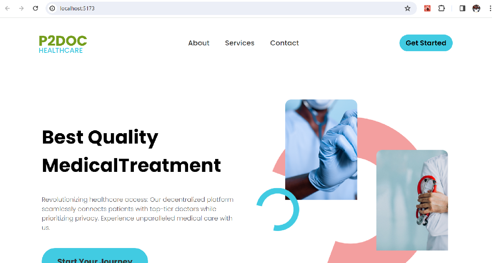

  

# 🩺 P2Doc Healthcare
> P2Doc is a platform that leverages the power of Web5 to ensure a secure sharing of medical records between patients and doctors, hence the name P2Doc, signifying Patient-to-Doctor interaction

## 🪧 Problem statement
Numerous individuals have faced unfortunate consequences due to the absence of a secure means through which their medical records can be confidentially shared. Maintaining the confidentiality of medical information, even when shared over the internet, remains a critical concern. When examining previous web technologies, such as Web2 and Web3, which are centralized, it becomes apparent that users' data is stored by third-party entities, leaving it vulnerable to exposure by malicious actors. Hence, we conceived the idea of concealing the sharing of medical records between doctors and patients by harnessing the power of decentralized technology (Web5).

## ⚙ Key features
The application offers the following key features:
- **Profile Creation:** 
  Both doctors and patients can easily create and manage their profiles based on their user type.

- **Doctor Dashboard:** 
  Doctors have access to a dedicated dashboard where they can view incoming requests from onboarded patients.

- **Appointment Management:** 
  Doctors can efficiently manage appointments, including viewing recently booked appointments.

- **Medical Record Management:** 
  Doctors can write and manage medical records securely within the platform.

- **Patient Appointment Booking:** 
  Patients can conveniently book appointments with their preferred doctors through the platform.

- **Medical Record Access:** 
  Patients can easily access and view their medical records, ensuring transparency and convenience.

## 🚦 Getting Started
To get a local copy up and running, follow these steps.
### Prerequisites
To run this project you need:

- Node.js and npm:
Ensure that Node.js, a JavaScript runtime, is installed on your machine.
npm (Node Package Manager) is typically included with Node.js.

- Text Editor:
Choose a preferred text editor for code editing. Popular choices include Visual Studio Code, Sublime Text, or Atom.

- Web Browser:
Have a modern web browser installed (e.g., Google Chrome, Mozilla Firefox, or Microsoft Edge) to launch and interact with the application.

## 🗝️ Set up

Step 1: Clone this repository to your desired path:
```
git clone https://github.com/Chrissiku/p2doc-healthcare.git
```

Step 2: Change the directory (dir) to p2doc-healthcare path
```
cd p2doc-healthcare
```

Step 3: Install all the required dependencies (using npm in our case)
```
npm install
```

Step 4: Run the project locally by starting the server
```
npm run dev
``` 

## 🎲 Configuration

To ensure optimal functionality of the application, create a `.env` file in the root of your repository and add the following variables:

```
VITE_PUBLIC_DID=did:ion:EiCXbwh...JnIn19
VITE_PROTOCOL_URL=http://localhost:5173/
```

**Note:** 
To generate a token for `VITE_PUBLIC_DID`, navigate to `Web5Context.jsx` file and add the `console.log(did)` statement at the end of the `useEffect` where the `did` is set.
Generate the token from the browser console, and paste the token into your variable.

## 🌎 Deployment

To run the application in a production environment, you can access the live version using the following URL:
- [p2doc healthcare](https://p2doc-healthcare-rho.vercel.app/)


## 👥 Contributors

- **👤 Christian Siku**
- **👤 Gina Beki**
- **👤 Sunday Peter**
- **👤 Hussein Yusuf**


## 🪪 License
This project is licensed under the [MIT License](LICENSE) - see the [LICENSE](LICENSE) file for details.
